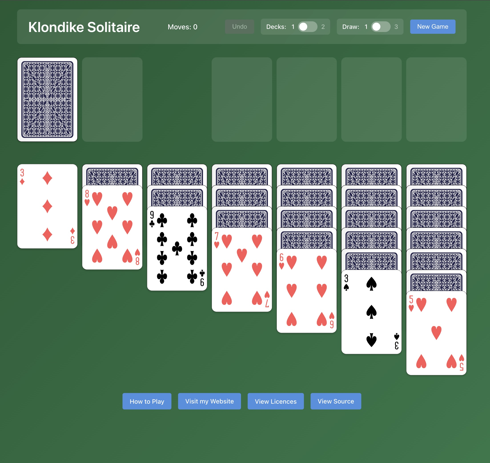

# Klondike Solitaire

A React TypeScript implementation of the classic Klondike solitaire card game, deployed as a static website on AWS.


- [Klondike Solitaire](#klondike-solitaire)
  - [Screenshots](#screenshots)
  - [Features](#features)
  - [Technology Stack](#technology-stack)
  - [Project Structure](#project-structure)
  - [Local Development](#local-development)
    - [Prerequisites](#prerequisites)
    - [Setup](#setup)
  - [AWS Deployment](#aws-deployment)
    - [Prerequisites](#prerequisites-1)
    - [Deployment Steps](#deployment-steps)
  - [How to Play](#how-to-play)
    - [Setup](#setup-1)
    - [Objective](#objective)
    - [Gameplay Rules](#gameplay-rules)
    - [Controls](#controls)
  - [Card Images](#card-images)
  - [Terraform Documentation](#terraform-documentation)
  - [Requirements](#requirements)
  - [Providers](#providers)
  - [Modules](#modules)
  - [Resources](#resources)
  - [Inputs](#inputs)
  - [Outputs](#outputs)


## Screenshots



## Features

- **Classic Klondike Rules**: 7-column tableau layout with traditional gameplay
- **Multiple Game Modes**:
  - 1 or 2 deck modes
  - Draw 1 or 3 cards from stock
- **Intuitive Controls**:
  - Drag-and-drop card movement (Desktop)
  - Click-to-select and click-to-move (Desktop and mobile)
  - Double-click to auto-move cards to foundations
- **Responsive Design**: Fully optimized for mobile, tablet, and desktop devices
- **Smart Foundation Placement**: Cards automatically go to the correct foundation when dropped
- **Multi-card Selection**: Visual highlighting of entire card sequences
- **Undo Functionality**: Step back through move history
- **Victory Animation**: Fireworks celebration when you win
- **Move Counter**: Track your progress
- **Professional Card Graphics**: SVG images from Wikimedia Commons (Byron Knoll set, Public Domain)

## Technology Stack

- **Frontend**: React 18 with TypeScript
- **Build Tool**: Vite
- **Package Manager**: Bun
- **Deployment**: AWS S3 + CloudFront (via Terraform/OpenTofu)

## Project Structure

```
/frontend         - React application
  /src           - React components and game logic
  /public        - Static assets
/terraform       - Infrastructure as Code
/dev_tooling     - Development utilities
```

## Local Development

### Prerequisites

- [Bun](https://bun.sh) installed on your system
- [Go](https://golang.org) (for downloading card images)

### Setup

1. Install frontend dependencies:
```bash
cd frontend
bun install
```

2. Download card images (if not already present):
```bash
cd dev_tooling/download_cards
go run main.go
cd ../..
```

3. Start the development server:
```bash
cd frontend
bun dev
```

The game will be available at http://localhost:5173

## AWS Deployment

The game is deployed to AWS using Terraform/OpenTofu with:
- **S3**: Static file hosting
- **CloudFront**: Global CDN distribution
- **ACM**: SSL/TLS certificates
- **Route53**: DNS management

The frontend will be automatically built and deployed to S3, with CloudFront distribution created and cache invalidated


### Prerequisites

- AWS CLI configured
- Terraform/OpenTofu installed
- Route53 hosted zone for your domain
- Bun installed 

### Deployment Steps

Navigate to terraform directory, add required vars and `apply` from there

## How to Play

### Setup

**1-Deck Mode:**
- 52 cards dealt into 7 tableau columns (1, 2, 3, 4, 5, 6, 7 cards respectively)
- Only the top card in each tableau column starts face-up
- 4 empty foundations (one per suit)
- Remaining cards go to the stock (draw pile)

**2-Deck Mode:**
- 104 cards dealt into 9 tableau columns (1, 2, 3, 4, 5, 6, 7, 8, 9 cards respectively)
- Only the top card in each tableau column starts face-up
- 8 empty foundations (two per suit)
- Each deck has a different colored back (blue and red)
- Remaining cards go to the stock (draw pile)

### Objective
Move all cards to the foundations, building from Ace to King by suit. In 2-deck mode, each foundation holds 13 cards (Ace through King) of the same suit.

### Gameplay Rules

**Tableau Moves:**
- Cards can be moved between columns in descending rank and alternating colors (red/black)
- Multi-card sequences can be moved together as a unit
- Only Kings can be placed on empty columns

**Stock/Waste:**
- Click the stock to draw cards (1 or 3 at a time, based on settings)
- Play the top waste card to tableau or foundations
- When stock is empty, click to recycle waste back to stock

**Foundations:**
- Must start with an Ace
- Build up in sequence by suit (Ace → 2 → 3 ... → King)
- Cards can be moved from foundations back to tableau if needed

**Auto-completion:**
- When stock and waste are empty and all cards are face-up, remaining cards automatically move to foundations

### Controls

**Card Movement:**
- **Drag-and-drop**: Drag cards between tableau columns, to foundations, or from waste
- **Click-to-select**: Click a card to select it, then click destination to move
- **Double-click**: Automatically moves card to the appropriate foundation

**Smart Foundation Drops:**
- Drop a card on any foundation space - it will automatically go to the correct foundation for that suit

**Game Settings (Slider Switches):**
- **Decks**: Toggle between 1 and 2 deck modes (starts new game)
- **Draw**: Toggle between drawing 1 or 3 cards (starts new game)

**Buttons:**
- **Undo**: Step back one move (disabled when no history)
- **New Game**: Start a fresh game with current settings

## Card Images

**Card Faces** (Public Domain): 52 card face images by Byron Knoll from the [SVG English pattern playing cards collection](https://commons.wikimedia.org/wiki/Category:SVG_English_pattern_playing_cards) on Wikimedia Commons.

**Card Backs** (CC BY-SA 3.0): Blue and red card back designs from Wikimedia Commons ([Reverso baraja española](https://commons.wikimedia.org/wiki/File:Reverso_baraja_espa%C3%B1ola.svg) and [rojo variant](https://commons.wikimedia.org/wiki/File:Reverso_baraja_espa%C3%B1ola_rojo.svg)).

The download script in [`dev_tooling/download_cards`](dev_tooling/download_cards) fetches all images automatically.

## Terraform Documentation

<!-- BEGIN_TF_DOCS -->
## Requirements

| Name | Version |
|------|---------|
| <a name="requirement_terraform"></a> [terraform](#requirement\_terraform) | >= 1.10.0 |
| <a name="requirement_aws"></a> [aws](#requirement\_aws) | >=6.26.0 |

## Providers

| Name | Version |
|------|---------|
| <a name="provider_aws"></a> [aws](#provider\_aws) | 6.27.0 |
| <a name="provider_null"></a> [null](#provider\_null) | 3.2.4 |

## Modules

| Name | Source | Version |
|------|--------|---------|
| <a name="module_frontend_website"></a> [frontend\_website](#module\_frontend\_website) | registry.terraform.io/joshuamkite/static-website-s3-cloudfront-acm/aws | 2.4.0 |

## Resources

| Name | Type |
|------|------|
| [null_resource.build_frontend](https://registry.terraform.io/providers/hashicorp/null/latest/docs/resources/resource) | resource |
| [null_resource.invalidate_cloudfront](https://registry.terraform.io/providers/hashicorp/null/latest/docs/resources/resource) | resource |
| [null_resource.sync_frontend_to_s3](https://registry.terraform.io/providers/hashicorp/null/latest/docs/resources/resource) | resource |
| [aws_caller_identity.current](https://registry.terraform.io/providers/hashicorp/aws/latest/docs/data-sources/caller_identity) | data source |
| [aws_region.current](https://registry.terraform.io/providers/hashicorp/aws/latest/docs/data-sources/region) | data source |

## Inputs

| Name | Description | Type | Default | Required |
|------|-------------|------|---------|:--------:|
| <a name="input_aws_region"></a> [aws\_region](#input\_aws\_region) | AWS region for deployment | `string` | `"eu-west-2"` | no |
| <a name="input_backend_bucket"></a> [backend\_bucket](#input\_backend\_bucket) | S3 bucket name for Terraform state | `string` | n/a | yes |
| <a name="input_backend_key"></a> [backend\_key](#input\_backend\_key) | S3 key path for Terraform state | `string` | n/a | yes |
| <a name="input_backend_region"></a> [backend\_region](#input\_backend\_region) | AWS region for Terraform state bucket | `string` | n/a | yes |
| <a name="input_default_tags"></a> [default\_tags](#input\_default\_tags) | Default tags to apply to all resources | `map(string)` | `{}` | no |
| <a name="input_environment"></a> [environment](#input\_environment) | Environment name (dev, staging, prod) | `string` | `"dev"` | no |
| <a name="input_frontend_domain_name"></a> [frontend\_domain\_name](#input\_frontend\_domain\_name) | Domain name for the React frontend | `string` | n/a | yes |
| <a name="input_frontend_parent_zone_name"></a> [frontend\_parent\_zone\_name](#input\_frontend\_parent\_zone\_name) | Parent hosted zone name for frontend (for subdomains). If not set, uses hosted\_zone\_name | `string` | `""` | no |
| <a name="input_hosted_zone_name"></a> [hosted\_zone\_name](#input\_hosted\_zone\_name) | Route53 hosted zone name for DNS | `string` | n/a | yes |
| <a name="input_project_name"></a> [project\_name](#input\_project\_name) | Name of the project | `string` | `"klondike-solitaire"` | no |

## Outputs

| Name | Description |
|------|-------------|
| <a name="output_cloudfront_distribution_id"></a> [cloudfront\_distribution\_id](#output\_cloudfront\_distribution\_id) | CloudFront distribution ID |
| <a name="output_cloudfront_domain_name"></a> [cloudfront\_domain\_name](#output\_cloudfront\_domain\_name) | CloudFront distribution domain name |
| <a name="output_s3_bucket_id"></a> [s3\_bucket\_id](#output\_s3\_bucket\_id) | S3 bucket ID for frontend |
| <a name="output_website_url"></a> [website\_url](#output\_website\_url) | Website URL |
<!-- END_TF_DOCS -->

